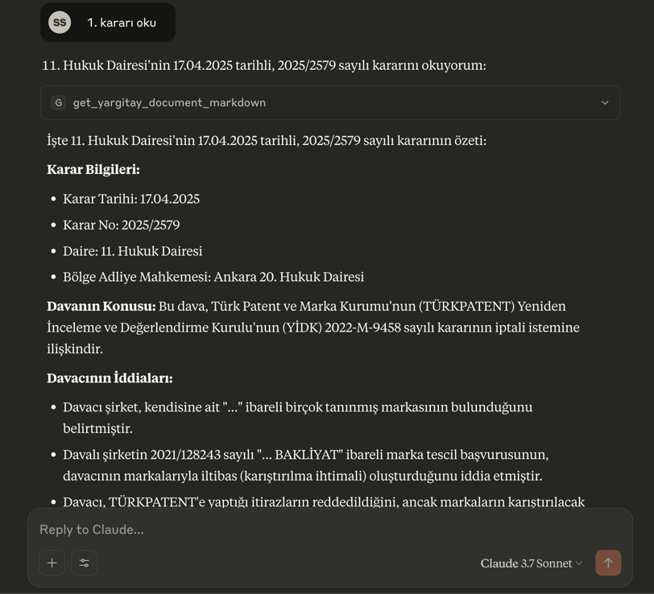
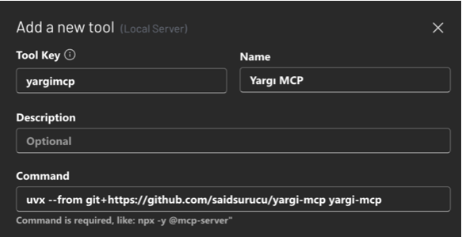

# Yargı MCP: Türk Hukuk Kaynakları için MCP Sunucusu

[](https://mcptoplist.com/server/glama%2Fsaidsurucu%2Fyargi-mcp)

> ## ✨ Profesyonel Sürüm Hazır: Yargı MCP Pro
>
> **Mevzuat ve içtihatı tek bir MCP sunucusunda birleştiren** profesyonel sürüm yayında:
>
> 👉 **https://yargi.betaspacestudio.com**

> ## 🚨 SUNUCU YENİ ADRESE TAŞINDI
>
> **Yeni Remote MCP adresi:** `https://yargimcp.surucu.dev/mcp`
>
> **Eski adres** (`https://yargimcp.fastmcp.app/mcp`) **artık kullanım dışıdır** — yalnızca taşındığını bildiren bir uyarı tool'u döner.
>
> **Yapmanız gereken:** MCP istemcinizdeki (Claude Desktop, 5ire, Google Antigravity, ChatGPT vb.) sunucu URL'sini yukarıdaki yeni adresle güncelleyin.

## Word'den UDF'ye profesyonel dönüşüm için yeni uygulamam [udfcevir.com](https://udfcevir.com) adresinde! 

[](https://www.star-history.com/#saidsurucu/yargi-mcp&Date)

Bu proje, çeşitli Türk hukuk kaynaklarına (Yargıtay, Danıştay, Emsal Kararlar, Uyuşmazlık Mahkemesi, Anayasa Mahkemesi - Norm Denetimi ile Bireysel Başvuru Kararları, Kamu İhale Kurulu Kararları, Rekabet Kurumu Kararları, Sayıştay Kararları, KVKK Kararları, BDDK Kararları, BTK Kararları, GİB Özelgeleri ve Sigorta Tahkim Komisyonu Kararları) erişimi kolaylaştıran bir [FastMCP](https://gofastmcp.com/) sunucusu oluşturur. Bu sayede, bu kaynaklardan veri arama ve belge getirme işlemleri, Model Context Protocol (MCP) destekleyen LLM (Büyük Dil Modeli) uygulamaları (örneğin Claude Desktop veya [5ire](https://5ire.app)) ve diğer istemciler tarafından araç (tool) olarak kullanılabilir hale gelir.

---

## 🚀 5 Dakikada Başla (Remote MCP)

### ✅ Kurulum Gerektirmez! Hemen Kullan!

🔗 **Remote MCP Adresi:** `https://yargimcp.surucu.dev/mcp`

> ⚠️ **Eski adres** `https://yargimcp.fastmcp.app/mcp` **artık kullanım dışıdır** — yalnızca taşındığını bildiren bir uyarı tool'u döner. Lütfen yukarıdaki yeni adresi kullanın.

### Claude Desktop ile Kullanım (Ücretli abonelik gerekir)

1. **Claude Desktop'ı açın**
2. **Settings → Connectors → Add Custom Connector**
3. **Bilgileri girin:**
   - **Name:** `Yargı MCP`
   - **URL:** `https://yargimcp.surucu.dev/mcp`
4. **Add** butonuna tıklayın
5. **Hemen kullanmaya başlayın!** 🎉

### Google Antigravity ile Kullanım (Lokal `uv` Kurulumu — Kopyala-Yapıştır)

> **Ön Gereksinimler:** Bilgisayarınızda **Python**, **`uv`** ([kurulum](https://docs.astral.sh/uv/getting-started/installation/)) ve **Node.js** ([indir](https://nodejs.org/en/download)) kurulu olmalı. (Node.js yalnızca aşağıdaki kurulum komutunu çalıştırmak için gerekir; MCP'yi `uvx` çalıştırır.)

Aşağıdaki **bloğun tamamını** terminale yapıştırın. Komut, Antigravity'nin okuduğu `~/.gemini/config/mcp_config.json` dosyasını sizin yerinize oluşturur/günceller (varsa diğer sunucularınız korunur):

**macOS / Linux** (Terminal):

```bash
node - <<'YARGI'
const fs=require("fs"),os=require("os"),path=require("path");
const dir=path.join(os.homedir(),".gemini","config"),file=path.join(dir,"mcp_config.json");
fs.mkdirSync(dir,{recursive:true});
let cfg={};try{cfg=JSON.parse(fs.readFileSync(file,"utf8"))}catch{}
if(typeof cfg!=="object"||cfg===null||Array.isArray(cfg))cfg={};
if(typeof cfg.mcpServers!=="object"||cfg.mcpServers===null)cfg.mcpServers={};
cfg.mcpServers["yargi-mcp"]={command:"uvx",args:["yargi-mcp"]};
fs.writeFileSync(file,JSON.stringify(cfg,null,2)+"\n");
console.log("yargi-mcp eklendi -> "+file);
YARGI
```

**Windows** (PowerShell):

```powershell
@'
const fs=require("fs"),os=require("os"),path=require("path");
const dir=path.join(os.homedir(),".gemini","config"),file=path.join(dir,"mcp_config.json");
fs.mkdirSync(dir,{recursive:true});
let cfg={};try{cfg=JSON.parse(fs.readFileSync(file,"utf8"))}catch{}
if(typeof cfg!=="object"||cfg===null||Array.isArray(cfg))cfg={};
if(typeof cfg.mcpServers!=="object"||cfg.mcpServers===null)cfg.mcpServers={};
cfg.mcpServers["yargi-mcp"]={command:"uvx",args:["yargi-mcp"]};
fs.writeFileSync(file,JSON.stringify(cfg,null,2)+"\n");
console.log("yargi-mcp eklendi -> "+file);
'@ | node -
```

Komut `yargi-mcp eklendi -> ...` çıktısını verdiğinde kurulum tamamlanmıştır. Antigravity'yi (açıksa kapatıp) yeniden başlatın; `yargi-mcp` araçları otomatik yüklenir.

> 💡 **İpucu:** Lokal kurulumda hukuk kaynaklarına erişim doğrudan bilgisayarınızda `uvx yargi-mcp` ile çalışır; uzaktan sunucuya ihtiyaç duymaz.

### Remote MCP Sorun Giderme

`https://yargimcp.surucu.dev/mcp` bir web sayfası değil, Streamable HTTP MCP uç noktasıdır. Tarayıcıda açınca veya düz `curl` ile GET isteği atınca `406 Not Acceptable` ve `Client must accept text/event-stream` benzeri bir yanıt görmek normaldir; bu, sunucunun kapalı olduğu anlamına gelmez. MCP istemcisi `Accept: application/json, text/event-stream` başlığıyla JSON-RPC isteği göndermelidir.

Hızlı sağlık kontrolü için tarayıcıda şu adresleri açabilirsiniz:

- `https://yargimcp.surucu.dev/health` — servis sağlık durumu

Claude.ai veya başka bir istemci "araç yok" gibi davranırsa:

1. Connector'ı kaldırıp yeniden ekleyin.
2. URL olarak önce `https://yargimcp.surucu.dev/mcp` deneyin; istemciniz yönlendirmeleri takip etmiyorsa `https://yargimcp.surucu.dev/mcp/` deneyin.
3. Eski `https://yargimcp.fastmcp.app/mcp` adresinin istemci ayarlarında veya önbellekte kalmadığından emin olun.
4. İstemcinin remote/Streamable HTTP MCP desteklediğini ve `text/event-stream` kabul ettiğini kontrol edin.

---



🎯 **Temel Özellikler**

🚀 **YÜKSEK PERFORMANS OPTİMİZASYONU:** Bu MCP sunucusu **%61.8 token azaltma** ile optimize edilmiştir (8,692 token tasarrufu). Claude AI ile daha hızlı yanıt süreleri ve daha verimli etkileşim sağlar.

* Çeşitli Türk hukuk veritabanlarına programatik erişim için standart bir MCP arayüzü.
* **Kapsamlı Mahkeme Daire/Kurul Filtreleme:** 79 farklı daire/kurul filtreleme seçeneği
* **Dual/Triple API Desteği:** Her mahkeme için birden fazla API kaynağı ile maksimum kapsama
* **Kapsamlı Tarih Filtreleme:** Tüm Bedesten API araçlarında ISO 8601 formatında tarih aralığı filtreleme
* **Kesin Cümle Arama:** Tüm Bedesten API araçlarında çift tırnak ile tam cümle arama desteği
* Aşağıdaki kurumların kararlarını arama ve getirme yeteneği:
    * **Yargıtay:** Detaylı kriterlerle karar arama ve karar metinlerini Markdown formatında getirme. **Dual API** (Ana + Bedesten) + **52 Daire/Kurul Filtreleme** + **Tarih & Kesin Cümle Arama** (Hukuk/Ceza Daireleri, Genel Kurullar)
    * **Danıştay:** Anahtar kelime bazlı ve detaylı kriterlerle karar arama; karar metinlerini Markdown formatında getirme. **Triple API** (Keyword + Detailed + Bedesten) + **27 Daire/Kurul Filtreleme** + **Tarih & Kesin Cümle Arama** (İdari Daireler, Vergi/İdare Kurulları, Askeri Yüksek İdare Mahkemesi)
    * **Yerel Hukuk Mahkemeleri:** Bedesten API ile yerel hukuk mahkemesi kararlarına erişim + **Tarih & Kesin Cümle Arama**
    * **İstinaf Hukuk Mahkemeleri:** Bedesten API ile istinaf mahkemesi kararlarına erişim + **Tarih & Kesin Cümle Arama**
    * **Kanun Yararına Bozma (KYB):** Bedesten API ile olağanüstü kanun yoluna erişim + **Tarih & Kesin Cümle Arama**
    * **Emsal (UYAP):** Detaylı kriterlerle emsal karar arama ve karar metinlerini Markdown formatında getirme.
    * **Uyuşmazlık Mahkemesi:** Form tabanlı kriterlerle karar arama ve karar metinlerini (URL ile erişilen) Markdown formatında getirme.
    * **Anayasa Mahkemesi (Norm Denetimi):** Kapsamlı kriterlerle norm denetimi kararlarını arama; uzun karar metinlerini (5.000 karakterlik) sayfalanmış Markdown formatında getirme.
    * **Anayasa Mahkemesi (Bireysel Başvuru):** Kapsamlı kriterlerle bireysel başvuru "Karar Arama Raporu" oluşturma ve listedeki kararların metinlerini (5.000 karakterlik) sayfalanmış Markdown formatında getirme.
    * **KİK (Kamu İhale Kurulu):** Çeşitli kriterlerle Kurul kararlarını arama; uzun karar metinlerini (varsayılan 5.000 karakterlik) sayfalanmış Markdown formatında getirme.
    * **Rekabet Kurumu:** Çeşitli kriterlerle Kurul kararlarını arama; karar metinlerini Markdown formatında getirme.
    * **Sayıştay:** 3 karar türü ile kapsamlı denetim kararlarına erişim + **8 Daire Filtreleme** + **Tarih Aralığı & İçerik Arama** (Genel Kurul yorumlayıcı kararları, Temyiz Kurulu itiraz kararları, Daire ilk derece denetim kararları)
    * **KVKK (Kişisel Verilerin Korunması Kurulu):** Brave Search API ile veri koruma kararlarını arama; uzun karar metinlerini (5.000 karakterlik) sayfalanmış Markdown formatında getirme + **Türkçe Arama** + **Site Hedeflemeli Arama** (kvkk.gov.tr kararları)
    * **BDDK (Bankacılık Düzenleme ve Denetleme Kurumu):** Bankacılık düzenleme kararlarını arama; karar metinlerini Markdown formatında getirme + **Optimized Search** + **"Karar Sayısı" Targeting** + **Spesifik URL Filtreleme** (bddk.org.tr/Mevzuat/DokumanGetir)
    * **BTK (Bilgi Teknolojileri ve İletişim Kurumu):** Kurul Kararlarını arama (anahtar kelime + karar no + karar tarihi + yayın tarihi + ilgili birim filtreleri); karar PDF'lerini (5.000 karakterlik) sayfalanmış Markdown formatında getirme (btk.gov.tr)
    * **GİB (Gelir İdaresi Başkanlığı) Özelgeleri:** Resmi vergi özelgelerini arama (18.000+ özelge: KDV, Kurumlar, Gelir, ÖTV, Damga vb.); tam metni sayfalanmış Markdown formatında getirme + **Keyword + Özelge No + Kanun No + Tarih Aralığı** + **Otomatik ISO 8601 Dönüşümü** + **Metadata Başlık Bloğu**
    * **Sigorta Tahkim Komisyonu:** Hakem Karar Dergisi (64 sayı, 2010-2025) içindeki sigorta tahkim kararlarını arama; dergi PDF'lerini Markdown formatında getirme + **Sayı İçi Karar Arama** + **Türkçe Büyük/Küçük Harf Desteği** + **Relevance Scoring**

* Karar metinlerinin daha kolay işlenebilmesi için Markdown formatına çevrilmesi.
* Claude Desktop uygulaması ile `fastmcp install` komutu kullanılarak kolay entegrasyon.
* Yargı MCP artık [5ire](https://5ire.app) gibi Claude Desktop haricindeki MCP istemcilerini de destekliyor!
---
<details>
<summary>🚀 <strong>Claude Haricindeki Modellerle Kullanmak İçin Çok Kolay Kurulum (Örnek: 5ire için)</strong></summary>

Bu bölüm, Yargı MCP aracını 5ire gibi Claude Desktop dışındaki MCP istemcileriyle kullanmak isteyenler içindir.

* **Python Kurulumu:** Sisteminizde Python 3.11 veya üzeri kurulu olmalıdır. Kurulum sırasında "**Add Python to PATH**" (Python'ı PATH'e ekle) seçeneğini işaretlemeyi unutmayın. [Buradan](https://www.python.org/downloads/) indirebilirsiniz.
* **Git Kurulumu (Windows):** Bilgisayarınıza [git](https://git-scm.com/downloads/win) yazılımını indirip kurun. "Git for Windows/x64 Setup" seçeneğini indirmelisiniz.
* **`uv` Kurulumu:**
    * **Windows Kullanıcıları (PowerShell):** Bir CMD ekranı açın ve bu kodu çalıştırın: `powershell -ExecutionPolicy ByPass -c "irm https://astral.sh/uv/install.ps1 | iex"`
    * **Mac/Linux Kullanıcıları (Terminal):** Bir Terminal ekranı açın ve bu kodu çalıştırın: `curl -LsSf https://astral.sh/uv/install.sh | sh`
* **Microsoft Visual C++ Redistributable (Windows):** Bazı Python paketlerinin doğru çalışması için gereklidir. [Buradan](https://learn.microsoft.com/en-us/cpp/windows/latest-supported-vc-redist?view=msvc-170) indirip kurun.
* İşletim sisteminize uygun [5ire](https://5ire.app) MCP istemcisini indirip kurun.
* 5ire'ı açın. **Workspace -> Providers** menüsünden kullanmak istediğiniz LLM servisinin API anahtarını girin.
* **Tools** menüsüne girin. **+Local** veya **New** yazan butona basın.
    * **Tool Key:** `yargimcp`
    * **Name:** `Yargı MCP`
    * **Command:**
        ```
        uvx yargi-mcp
        ```
    * **Save** butonuna basarak kaydedin.

* Şimdi **Tools** altında **Yargı MCP**'yi görüyor olmalısınız. Üstüne geldiğinizde sağda çıkan butona tıklayıp etkinleştirin (yeşil ışık yanmalı).
* Artık Yargı MCP ile konuşabilirsiniz.

</details>

---
<details>
<summary>⚙️ <strong>Claude Desktop Lokal Kurulumu (Kopyala-Yapıştır)</strong></summary>

> **Ön Gereksinimler:** Bilgisayarınızda **Python**, **`uv`** ([kurulum](https://docs.astral.sh/uv/getting-started/installation/)), **Node.js** ([indir](https://nodejs.org/en/download)) ve (Windows için) Microsoft Visual C++ Redistributable kurulu olmalı. (Node.js yalnızca aşağıdaki kurulum komutunu çalıştırmak için gerekir; MCP'yi `uvx` çalıştırır.)

Aşağıdaki **bloğun tamamını** terminale yapıştırın. Komut, Claude Desktop'ın `claude_desktop_config.json` dosyasını sizin yerinize oluşturur/günceller (varsa diğer sunucularınız korunur):

**macOS / Linux** (Terminal):

```bash
node - <<'YARGI'
const fs=require("fs"),os=require("os"),path=require("path");
const dir=process.platform==="darwin"
  ? path.join(os.homedir(),"Library","Application Support","Claude")
  : path.join(os.homedir(),".config","Claude");
const file=path.join(dir,"claude_desktop_config.json");
fs.mkdirSync(dir,{recursive:true});
let cfg={};try{cfg=JSON.parse(fs.readFileSync(file,"utf8"))}catch{}
if(typeof cfg!=="object"||cfg===null||Array.isArray(cfg))cfg={};
if(typeof cfg.mcpServers!=="object"||cfg.mcpServers===null)cfg.mcpServers={};
cfg.mcpServers["yargi-mcp"]={command:"uvx",args:["yargi-mcp"]};
fs.writeFileSync(file,JSON.stringify(cfg,null,2)+"\n");
console.log("yargi-mcp eklendi -> "+file);
YARGI
```

**Windows** (PowerShell):

```powershell
@'
const fs=require("fs"),os=require("os"),path=require("path");
const dir=path.join(process.env.APPDATA||path.join(os.homedir(),"AppData","Roaming"),"Claude");
const file=path.join(dir,"claude_desktop_config.json");
fs.mkdirSync(dir,{recursive:true});
let cfg={};try{cfg=JSON.parse(fs.readFileSync(file,"utf8"))}catch{}
if(typeof cfg!=="object"||cfg===null||Array.isArray(cfg))cfg={};
if(typeof cfg.mcpServers!=="object"||cfg.mcpServers===null)cfg.mcpServers={};
cfg.mcpServers["yargi-mcp"]={command:"uvx",args:["yargi-mcp"]};
fs.writeFileSync(file,JSON.stringify(cfg,null,2)+"\n");
console.log("yargi-mcp eklendi -> "+file);
'@ | node -
```

Komut `yargi-mcp eklendi -> ...` çıktısını verdiğinde kurulum tamamlanmıştır. **Claude Desktop'ı tamamen kapatıp yeniden başlatın**; `yargi-mcp` araçları otomatik yüklenir.

---

**Manuel alternatif:** Claude Desktop **Settings → Developer → Edit Config** menüsünden `claude_desktop_config.json` dosyasını açıp `mcpServers` altına ekleyebilirsiniz:

```json
{
  "mcpServers": {
    "yargi-mcp": {
      "command": "uvx",
      "args": ["yargi-mcp"]
    }
  }
}
```

</details>

---
<details>
<summary>🌟 <strong>Gemini CLI ile Kullanım</strong></summary>

Yargı MCP'yi Gemini CLI ile kullanmak için:

1. **Ön Gereksinimler:** Python, `uv`, (Windows için) Microsoft Visual C++ Redistributable'ın sisteminizde kurulu olduğundan emin olun. Detaylı bilgi için yukarıdaki "5ire için Kurulum" bölümündeki ilgili adımlara bakabilirsiniz.

2. **Gemini CLI ayarlarını yapılandırın:**
   
   Gemini CLI'ın ayar dosyasını düzenleyin:
   - **macOS/Linux:** `~/.gemini/settings.json`
   - **Windows:** `%USERPROFILE%\.gemini\settings.json`
   
   Aşağıdaki `mcpServers` bloğunu ekleyin:
   ```json
   {
     "theme": "Default",
     "selectedAuthType": "###",
     "mcpServers": {
       "yargi_mcp": {
         "command": "uvx",
         "args": [
           "yargi-mcp"
         ]
       }
     }
   }
   ```
   
   **Yapılandırma açıklamaları:**
   - `"yargi_mcp"`: Sunucunuz için yerel bir isim
   - `"command"`: `uvx` komutu (uv'nin paket çalıştırma aracı)
   - `"args"`: GitHub'dan doğrudan Yargı MCP'yi çalıştırmak için gerekli argümanlar

3. **Kullanım:**
   - Gemini CLI'ı başlatın
   - Yargı MCP araçları otomatik olarak kullanılabilir olacaktır
   - Örnek komutlar:
     - "Yargıtay'ın mülkiyet hakkı ile ilgili son kararlarını ara"
     - "Danıştay'ın imar planı iptaline ilişkin kararlarını bul"
     - "Anayasa Mahkemesi'nin ifade özgürlüğü kararlarını getir"

</details>

---
<details>
<summary>🧠 <strong>Semantik Arama (Opsiyonel)</strong></summary>

Yargı MCP, **semantik arama** özelliği ile kararları anlamsal olarak sıralayabilir. Opsiyoneldir; iki yoldan biri yapılandırıldığında otomatik etkinleşir:

- **Yerel** (önerilen, ücretsiz): kendi makinenizdeki OpenAI-uyumlu embedding sunucusu (HuggingFace TEI, llama.cpp, Ollama, vLLM, LM Studio…)
- **Hosted**: OpenRouter ya da [OrcaRouter](https://www.orcarouter.ai) API anahtarı

### Semantik Arama Nasıl Çalışır?
1. `initial_keyword` ile Bedesten API'den 100 karar çekilir
2. `query` ile bu kararlar embedding modeli kullanılarak anlamsal olarak sıralanır
3. En alakalı kararlar döndürülür

### Önerilen Türkçe Kurulumu (Yerel — `multilingual-e5-large`)

`intfloat/multilingual-e5-large` Türkçe için kıyas ettiğimiz açık kaynak modeller arasında en iyilerinden. HuggingFace'in **Text Embeddings Inference (TEI)** sunucusuyla tek komutta ayağa kalkar ve OpenAI-uyumlu API sunar:

```bash
docker run -p 8080:80 ghcr.io/huggingface/text-embeddings-inference:latest \
    --model-id intfloat/multilingual-e5-large
```

Sonra Yargı MCP'ye şu env vars'ları geçirin:

```bash
EMBEDDING_PROVIDER=local
LOCAL_EMBEDDING_BASE_URL=http://localhost:8080/v1
LOCAL_EMBEDDING_MODEL=intfloat/multilingual-e5-large
LOCAL_EMBEDDING_DIMENSION=1024
EMBEDDING_PROMPT_STYLE=e5
```

> ⚠️ **Önemli:** `EMBEDDING_PROMPT_STYLE=e5` şart — e5 modelleri `query:` / `passage:` öneki bekleyecek şekilde eğitilmiştir; yanlış önek sessizce kaliteyi düşürür.

#### Claude Desktop örneği (yerel TEI)
```json
{
  "mcpServers": {
    "Yargı MCP": {
      "command": "uvx",
      "args": ["yargi-mcp"],
      "env": {
        "EMBEDDING_PROVIDER": "local",
        "LOCAL_EMBEDDING_BASE_URL": "http://localhost:8080/v1",
        "LOCAL_EMBEDDING_MODEL": "intfloat/multilingual-e5-large",
        "LOCAL_EMBEDDING_DIMENSION": "1024",
        "EMBEDDING_PROMPT_STYLE": "e5"
      }
    }
  }
}
```

### Alternatif 1: Ollama (yerel, daha hafif kurulum)

```bash
ollama serve
ollama pull nomic-embed-text   # 768 dim, İngilizce ağırlıklı
```

```bash
EMBEDDING_PROVIDER=local
LOCAL_EMBEDDING_BASE_URL=http://localhost:11434/v1
LOCAL_EMBEDDING_MODEL=nomic-embed-text
LOCAL_EMBEDDING_DIMENSION=768
EMBEDDING_PROMPT_STYLE=raw
```

> Ollama kütüphanesinde `multilingual-e5-large` doğrudan yok; Türkçe için TEI yolu daha doğru sonuç verir.

### Alternatif 2: OpenRouter (hosted)

```bash
OPENROUTER_API_KEY=sk-or-v1-xxx...
# İsteğe bağlı — varsayılan google/gemini-embedding-001 (3072 dim, ÜCRETLİ)
# OPENROUTER_EMBEDDING_MODEL=...
# OPENROUTER_EMBEDDING_DIMENSION=...
# EMBEDDING_PROMPT_STYLE=gemini   # varsayılan
```

API anahtarınızı [openrouter.ai/keys](https://openrouter.ai/keys) adresinden alın. Varsayılan model `google/gemini-embedding-001` artık ücretli — ücretsiz bir model seçerseniz `OPENROUTER_EMBEDDING_MODEL`, `OPENROUTER_EMBEDDING_DIMENSION` ve uygun `EMBEDDING_PROMPT_STYLE` değerlerini birlikte ayarlayın.

### Alternatif 3: OrcaRouter (hosted)

[OrcaRouter](https://www.orcarouter.ai), 200+ modeli tek OpenAI-uyumlu uçta toplayan bir üretim AI ağ geçididir (ağ geçidi seviyesinde, sıfır-güven AI ajan güvenliği de içerir). Mevcut SDK kodu `base_url` değiştirilerek aynen çalışır.

```bash
ORCAROUTER_API_KEY=sk-orca-xxx...
# İsteğe bağlı — varsayılan google/gemini-embedding-001 (3072 dim, çok dilli)
# ORCAROUTER_EMBEDDING_MODEL=...
# ORCAROUTER_EMBEDDING_DIMENSION=...
# EMBEDDING_PROMPT_STYLE=gemini   # varsayılan
```

API anahtarınızı [www.orcarouter.ai](https://www.orcarouter.ai) adresinden alın. `OPENROUTER_API_KEY` yerine `ORCAROUTER_API_KEY` ayarlamanız yeterli — semantik arama aynı OpenAI-uyumlu akışı OrcaRouter ucu üzerinden kullanır.

### Yapılandırma Referansı

| Env Var | Açıklama | Örnek |
|---|---|---|
| `EMBEDDING_PROVIDER` | `local` ise yerel sunucu, boş ise hosted (OpenRouter/OrcaRouter) | `local` |
| `EMBEDDING_PROMPT_STYLE` | `gemini` / `e5` / `raw` — modelin beklediği önek | `e5` |
| `LOCAL_EMBEDDING_BASE_URL` | Yerel sunucunun OpenAI-uyumlu URL'i | `http://localhost:8080/v1` |
| `LOCAL_EMBEDDING_MODEL` | Model adı | `intfloat/multilingual-e5-large` |
| `LOCAL_EMBEDDING_DIMENSION` | Modelin çıktı boyutu (mutlaka eşleşmeli) | `1024` |
| `OPENROUTER_API_KEY` | OpenRouter anahtarı (sadece hosted için) | `sk-or-v1-…` |
| `OPENROUTER_EMBEDDING_MODEL` | OpenRouter model id'si | `google/gemini-embedding-001` |
| `OPENROUTER_EMBEDDING_DIMENSION` | OpenRouter modelinin çıktı boyutu | `3072` |
| `ORCAROUTER_API_KEY` | OrcaRouter anahtarı (sadece hosted için) | `sk-orca-…` |
| `ORCAROUTER_EMBEDDING_MODEL` | OrcaRouter model id'si | `google/gemini-embedding-001` |
| `ORCAROUTER_EMBEDDING_DIMENSION` | OrcaRouter modelinin çıktı boyutu | `3072` |

> 💡 **Not:** Hiçbir embedding sağlayıcı yapılandırılmazsa semantik arama aracı görünmez, diğer 28 araç normal şekilde çalışır.

</details>

<details>
<summary>🛠️ <strong>Kullanılabilir Araçlar (MCP Tools)</strong></summary>

Bu FastMCP sunucusu **26 aktif MCP aracı** + **1 opsiyonel semantik arama aracı** sunar (token verimliliği için optimize edilmiş):

### **Yargıtay Araçları (Birleşik Bedesten API - Token Optimized)**
*Not: Yargıtay araçları token verimliliği için birleşik Bedesten API'ye entegre edilmiştir*

### **Danıştay Araçları (Birleşik Bedesten API - Token Optimized)**
*Not: Danıştay araçları token verimliliği için birleşik Bedesten API'ye entegre edilmiştir*

### **Birleşik Bedesten API Araçları (5 Mahkeme) - 🚀 TOKEN OPTİMİZE**
1. `search_bedesten_unified(phrase, court_types, birimAdi, kararTarihiStart, kararTarihiEnd, ...)`: **5 mahkeme türünü** birleşik arama (Yargıtay, Danıştay, Yerel Hukuk, İstinaf Hukuk, KYB) + **79 daire filtreleme** + **Tarih & Kesin Cümle Arama**
2. `get_bedesten_document_markdown(documentId: str)`: Bedesten API'den herhangi bir belgeyi Markdown formatında getirir (HTML/PDF → Markdown)

### **Emsal Karar Araçları (UYAP)**
3. `search_emsal_detailed_decisions(keyword, ...)`: Emsal (UYAP) kararlarını detaylı kriterlerle arar.
4. `get_emsal_document_markdown(id: str)`: Belirli bir Emsal kararının metnini Markdown formatında getirir.

### **Uyuşmazlık Mahkemesi Araçları**
5. `search_uyusmazlik_decisions(icerik, ...)`: Uyuşmazlık Mahkemesi kararlarını çeşitli form kriterleriyle arar.
6. `get_uyusmazlik_document_markdown_from_url(document_url)`: Bir Uyuşmazlık kararını tam URL'sinden alıp Markdown formatında getirir.

### **Anayasa Mahkemesi Araçları (Birleşik API) - 🚀 TOKEN OPTİMİZE**
7. `search_anayasa_unified(decision_type, keywords_all, ...)`: AYM kararlarını birleşik arama (Norm Denetimi + Bireysel Başvuru) - **4 araç → 2 araç optimizasyonu**
8. `get_anayasa_document_unified(document_url, page_number)`: AYM kararlarını birleşik belge getirme - **sayfalanmış Markdown** içeriği

### **KİK (Kamu İhale Kurulu) Araçları**
9. `search_kik_v2_decisions(decision_type, karar_metni, karar_no, basvuran, idare_adi, baslangic_tarihi, bitis_tarihi)`: KİK v2 API ile uyuşmazlık, düzenleyici ve mahkeme kararlarını arar.
10. `get_kik_v2_document_markdown(gundemMaddesiId)`: Arama sonucundaki `gundemMaddesiId` ile KİK karar metnini Markdown formatında getirir.
### **Rekabet Kurumu Araçları**
    * `search_rekabet_kurumu_decisions(KararTuru: Literal[...], ...) -> RekabetSearchResult`: Rekabet Kurumu kararlarını arar. `KararTuru` için kullanıcı dostu isimler kullanılır (örn: "Birleşme ve Devralma").
    * `get_rekabet_kurumu_document(karar_id: str, page_number: Optional[int] = 1) -> RekabetDocument`: Belirli bir Rekabet Kurumu kararını `karar_id` ile alır. Kararın PDF formatındaki orijinalinden istenen sayfayı ayıklar ve Markdown formatında döndürür.


---

* **Sayıştay Araçları (Birleşik API, 3 Karar Türü + 8 Daire Filtreleme):**
    * `search_sayistay_unified(decision_type, start, length, ...)`: `genel_kurul`, `temyiz_kurulu` veya `daire` kararlarını tek araçla arar. `length` 1-100 aralığındadır.
    * `get_sayistay_document_unified(decision_id, decision_type)`: Birleşik arama sonucundaki karar ID'si ve karar türüyle tam metni Markdown formatında getirir.

* **KVKK Araçları (Brave Search API + Türkçe Arama):**
    * `search_kvkk_decisions(keywords, page)`: KVKK (Kişisel Verilerin Korunması Kurulu) kararlarını Brave Search API ile arar. **Türkçe arama** + **Site hedeflemeli** (`site:kvkk.gov.tr "karar özeti"`) + **Sayfalama desteği**. Sonuç sayısı sunucuda 10 olarak sabitlenmiştir.
    * `get_kvkk_document_markdown(decision_url: str, page_number: Optional[int] = 1)`: KVKK kararının tam metnini **sayfalanmış Markdown** formatında getirir (5.000 karakterlik sayfa)

### BDDK Araçları
    * `search_bddk_decisions(keywords, page)`: BDDK (Bankacılık Düzenleme ve Denetleme Kurumu) kararlarını arar. **"Karar Sayısı" targeting** + **Spesifik URL filtreleme** (`bddk.org.tr/Mevzuat/DokumanGetir`) + **Optimized search**
    * `get_bddk_document_markdown(document_id: str, page_number: Optional[int] = 1)`: BDDK kararının tam metnini **sayfalanmış Markdown** formatında getirir (5.000 karakterlik sayfa)

### BTK (Bilgi Teknolojileri ve İletişim Kurumu) Araçları (Resmi BTK JSON API)
    * `search_btk_decisions(keywords, decision_no, decision_date, publication_date, relevant_unit, page, pageSize)`: BTK Kurul Kararlarını arar. **Anahtar kelime + Karar No** (ör. `2026/DK-THD/91`) **+ Karar Tarihi + Yayın Tarihi + İlgili Birim** filtreleri + **Sayfalama** (`pageSize` 1-50)
    * `get_btk_document_markdown(pdf_url: str, page_number: int = 1)`: BTK kararının PDF'ini indirip **sayfalanmış Markdown** formatında getirir (5.000 karakterlik sayfa). `pdf_url`, `search_btk_decisions` sonucundaki `pdf_url` alanından alınır (`btk.gov.tr`)

### GİB (Gelir İdaresi Başkanlığı) Özelge Araçları (Resmi GİB JSON API)
    * `search_gib_ozelge(keywords, ozelgeNo, kanunNo, ozelgeStartDate, ozelgeEndDate, page, pageSize)`: GİB özelgelerini (Türk Gelir İdaresi Başkanlığı vergi özelgeleri) arar — **18.000+ özelge** (KDV, Kurumlar, Gelir, ÖTV, Damga, VUK vb.). **Keyword + Özelge No + Kanun No + Tarih Aralığı** + **Otomatik ISO 8601 Dönüşümü** (`YYYY-MM-DD` girdileri otomatik olarak full ISO 8601'e çevrilir)
    * `get_gib_ozelge_document_markdown(ozelge_id: int, page_number: int = 1)`: Belirli bir özelgenin tam metnini **sayfalanmış Markdown** formatında getirir (5.000 karakterlik sayfa) + **Metadata başlık bloğu** (Başlık, Sayı, Tarih, Kanun, Kaynak URL)

### Sigorta Tahkim Komisyonu Araçları (Tavily Search API + PDF)
    * `search_sigorta_tahkim_decisions(keywords, page)`: Sigorta Tahkim Komisyonu kararlarını Tavily Search API ile arar. **Site hedeflemeli** (`sigortatahkim.org`) + **Sayfalama desteği**. Sonuç sayısı sunucuda 10 olarak sabitlenmiştir.
    * `get_sigorta_tahkim_document_markdown(issue_number: str, page_number: int)`: Hakem Karar Dergisi sayısının PDF'ini indirip **sayfalanmış Markdown** formatında getirir (5.000 karakterlik sayfa). 64 sayı (2010-2025)
    * `search_within_sigorta_tahkim_issue(issue_number: str, keyword: str, max_results: int)`: Belirli bir dergi sayısı içindeki kararları anahtar kelime ile arar. **Türkçe İ/I desteği** + **Relevance scoring** + **Excerpt** ile sonuç

### Yardımcı ve Uyumluluk Araçları
    * `check_government_servers_health()`: Yargı kaynaklarının erişilebilirliğini kontrol eder.
    * `search(query)`: ChatGPT Deep Research uyumluluğu için Bedesten destekli kaynaklarda arama yapar.
    * `fetch(id)`: ChatGPT Deep Research uyumluluğu için tek bir Bedesten belge ID'sinin tam metnini getirir.

</details>

---

<details>
<summary>📊 <strong>Kapsamlı İstatistikler & Optimizasyon Başarıları</strong></summary>

🚀 **TOKEN OPTİMİZASYON BAŞARISI:**
- **%61.8 Token Azaltma:** 14,061 → 5,369 tokens (8,692 token tasarrufu)
- **Hedef Aşım:** 10,000 token hedefini 4,631 token aştık
- **Daha Hızlı Yanıt:** Claude AI ile optimize edilmiş etkileşim
- **Korunan İşlevsellik:** %100 özellik desteği devam ediyor

**GENEL İSTATİSTİKLER:**
- **Toplam Mahkeme/Kurum:** 16 farklı hukuki kurum (BTK, GİB Özelgeleri ve Sigorta Tahkim Komisyonu dahil)
- **Toplam MCP Tool:** 28 aktif araç + 1 opsiyonel semantik arama aracı
- **Daire/Kurul Filtreleme:** 87 farklı seçenek (52 Yargıtay + 27 Danıştay + 8 Sayıştay)
- **Tarih Filtreleme:** Birleşik Bedesten API aracında ISO 8601 formatında tam tarih aralığı desteği
- **Kesin Cümle Arama:** Birleşik Bedesten API aracında çift tırnak ile tam cümle arama (`"\"mülkiyet kararı\""` formatı)
- **Birleşik API:** 10 ayrı Bedesten aracı → 2 birleşik araç (search_bedesten_unified + get_bedesten_document_markdown)
- **API Kaynağı:** Dual/Triple API desteği ile maksimum kapsama
- **Tam Türk Adalet Sistemi:** Yerel mahkemelerden en yüksek mahkemelere kadar

**🏛️ Desteklenen Mahkeme Hiyerarşisi:**
```
Yerel Mahkemeler → İstinaf → Yargıtay/Danıştay → Anayasa Mahkemesi
     ↓              ↓            ↓                    ↓
Bedesten API   Bedesten API   Dual/Triple API   Norm+Bireysel API
+ Tarih + Kesin + Tarih + Kesin + Daire + Tarih   + Gelişmiş
  Cümle Arama    Cümle Arama   + Kesin Cümle     Arama
```

**⚖️ Kapsamlı Filtreleme Özellikleri:**
- **Daire Filtreleme:** 79 seçenek (52 Yargıtay + 27 Danıştay)
  - **Yargıtay:** 52 seçenek (1-23 Hukuk, 1-23 Ceza, Genel Kurullar, Başkanlar Kurulu)
  - **Danıştay:** 27 seçenek (1-17 Daireler, İdare/Vergi Kurulları, Askeri Mahkemeler)
- **Tarih Filtreleme:** 5 Bedesten API aracında ISO 8601 formatı (YYYY-MM-DDTHH:MM:SS.000Z)
  - Tek tarih, tarih aralığı, tek taraflı filtreleme desteği
  - Yargıtay, Danıştay, Yerel Hukuk, İstinaf Hukuk, KYB kararları
- **Kesin Cümle Arama:** 5 Bedesten API aracında çift tırnak formatı
  - Normal arama: `"mülkiyet kararı"` (kelimeler ayrı ayrı)
  - Kesin arama: `"\"mülkiyet kararı\""` (tam cümle olarak)
  - Daha kesin sonuçlar için hukuki terimler ve kavramlar

**🔧 OPTİMİZASYON DETAYLARI:**
- **Anayasa Mahkemesi:** 4 araç → 2 birleşik araç (search_anayasa_unified + get_anayasa_document_unified)
- **Yargıtay & Danıştay:** Ana API araçları birleşik Bedesten API'ye entegre edildi
- **Sayıştay:** 6 araç → 2 birleşik araç (search_sayistay_unified + get_sayistay_document_unified)
- **Parameter Optimizasyonu:** pageSize parametreleri optimize edildi
- **Açıklama Optimizasyonu:** Uzun açıklamalar kısaltıldı (örn: KIK karar_metni)

</details>

---

<details>
<summary>🌐 <strong>Web Service / ASGI Deployment</strong></summary>

Yargı MCP artık web servisi olarak da çalıştırılabilir! ASGI desteği sayesinde:

- **Web API olarak erişim**: HTTP endpoint'leri üzerinden MCP araçlarına erişim
- **Cloud deployment**: Heroku, Railway, Google Cloud Run, AWS Lambda desteği
- **Docker desteği**: Production-ready Docker container
- **FastAPI entegrasyonu**: REST API ve interaktif dokümantasyon

**Hızlı başlangıç:**
```bash
# ASGI dependencies yükle
pip install yargi-mcp[asgi]

# Web servisi olarak başlat
python run_asgi.py
# veya
uvicorn asgi_app:app --host 0.0.0.0 --port 8000
```

Detaylı deployment rehberi için: [docs/DEPLOYMENT.md](docs/DEPLOYMENT.md)

</details>

---

📜 **Lisans**

Bu proje MIT Lisansı altında lisanslanmıştır. Detaylar için `LICENSE` dosyasına bakınız.
